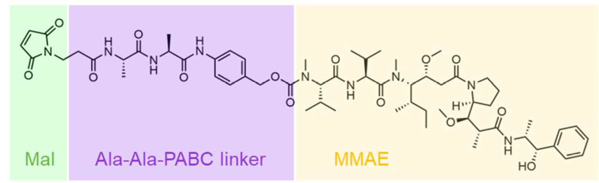
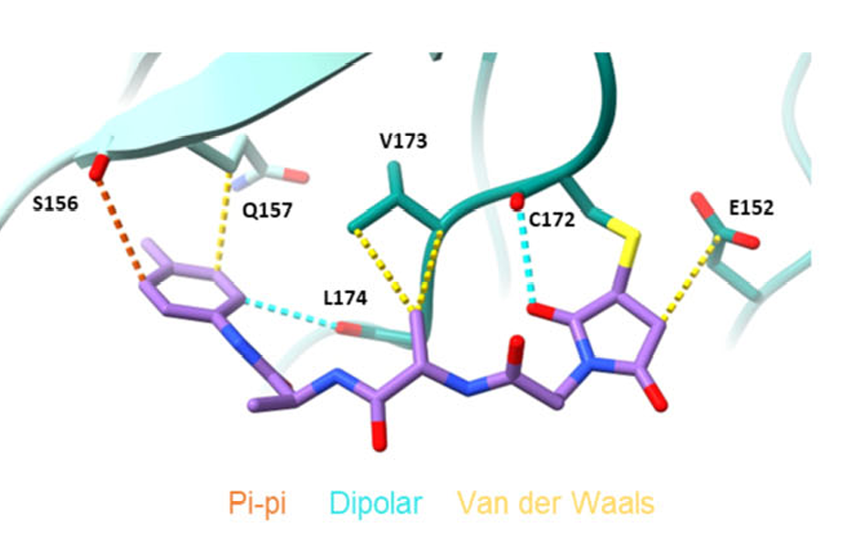
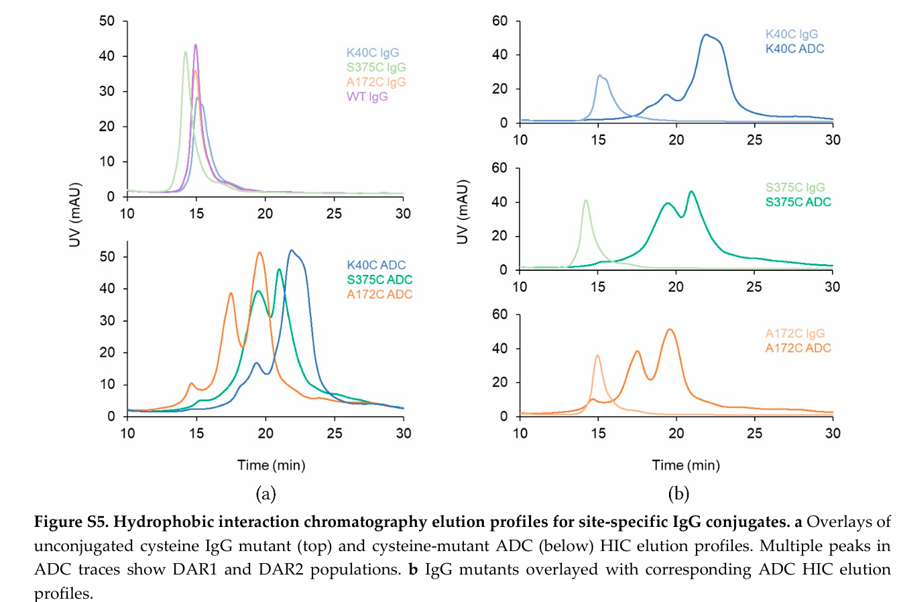
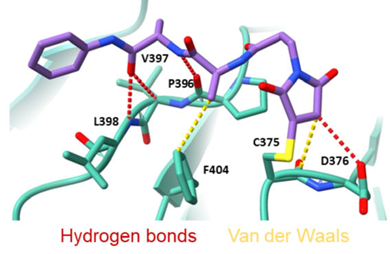

*Based on Jaime-Garza et al.,* **Structural Characterization of Linker Shielding in ADC Site-Specific Conjugates** *(Pharmaceutics, 2025; [paper link](https://www.mdpi.com/1999-4923/17/12/1568)).* 

Antibody–drug conjugate (ADC) design is often framed as a problem of choosing the right antibody, linker, and payload. That description is useful, but incomplete. Recent reviews of ADC conjugation technology make clear that the method and location of drug attachment are major determinants of homogeneity, pharmacokinetics, and therapeutic performance. The structural study by Jaime-Garza and colleagues sharpens that general principle by showing that **the conjugation site itself is a design variable with mechanistic consequences** [1,3].

What makes the paper especially interesting is not simply that different sites behave differently. We already suspected that. The important result is that the antibody can create a local environment that **partially shields the cleavable linker region**, changing how the conjugated species is exposed to solvent and how the release architecture is presented before lysosomal processing.

For scientists interested in developability and molecular mechanism, I think the paper is most useful when distilled into three points.

---

## 1. The antibody is not just a carrier — it can organize the cleavable linker region

The most important message of the paper is that the antibody surface can actively shape linker behavior. In the trastuzumab-derived Fab and Fc systems studied here, some engineered cysteine sites position the linker in or near a pocket where the surrounding protein surface partially buries it. Other sites leave the linker much more exposed.

That difference matters because the conjugated linker is not a passive appendage. Its local environment affects:

- solvent exposure
- conformational mobility
- accessibility of the cleavable region
- the likelihood of stabilizing local contacts

The chemistry used in this study is shown below.

*Figure 1. Chemical structure of the cysteine-reactive Ala-Ala–PABC–MMAE linker–payload. The Ala-Ala dipeptide and PABC spacer together define the cleavable release architecture.*

Because the Ala-Ala dipeptide is part of the protease-sensitive trigger, the structural question is not just whether the linker is attached, but whether the **cleavable region** is left exposed or instead becomes partially accommodated by the antibody.

This is easiest to see in the Fab **A172C** structure. In the authors’ structural analysis, the Ala-Ala–PABC linker was reported to bind in a hydrophobic region in the Fab pocket, burying approximately **326 Ų** of solvent-accessible surface area. The maleimide forms van der Waals contacts with E152 as well as dipole–dipole interactions with the backbone carbonyl of C172, while additional contacts involving V173, E157, L174, S159, Y180, and Y149 help stabilize the linker within the pocket. Importantly, hydrophobic residues such as **V173, L174, Y180, and Y149 shield roughly half of the linker’s solvent accessibility**.

*Figure 2. Residue-level interactions between the shielded linker region and surrounding Fab residues at **A172C** (PDB **9YZZ**). The cleavable Ala-Ala–PABC architecture is partially accommodated in a defined pocket and stabilized by multiple local contacts.*

The conceptual shift is simple but important:

> A conjugation site is not merely a chemically addressable residue. It is a local structural environment for the cleavable linker region.

That is the level at which site selection should be discussed.

---

## 2. Shielding of the cleavable linker region provides a structural explanation for site-dependent behavior

One of the most useful aspects of the paper is that the structural observations line up with analytical behavior. The reported HIC trend shows that:

- **Fab K40C** is the most retained / most hydrophobic
- **Fc S375C** is intermediate
- **Fab A172C** is the least retained / least hydrophobic

*Figure 3. HIC elution profiles for ADCs conjugated at different sites. The trend is consistent with the structural models: sites that provide stronger local shielding of the linker region produce less retained conjugates, whereas more exposed sites show stronger HIC retention.*

That ordering is not random. It follows the same logic seen in the structures: the more effectively the antibody shields the linker, the less exposed the conjugated architecture appears to be.

This point becomes especially interesting for cleavable linkers such as Ala-Ala–PABC. Because the Ala-Ala dipeptide is part of the protease-sensitive release trigger, the observation that the Ala-Ala region and part of the PABC spacer retain clear electron density suggests that this segment is not freely disordered, but at least partly organized and locally shielded by the antibody surface. That raises a plausible mechanistic possibility: conjugation-site geometry may influence not only general linker exposure, but also how accessible the trigger region is before lysosomal delivery.

The key word, however, is *plausible*. Structural ordering is consistent with local protection, but it is not by itself proof of slower cleavage in circulation, reduced systemic toxicity, or a higher MTD. Those links would require dedicated plasma-stability, protease-cleavage, and in vivo tolerability studies. This interpretation is also consistent with the larger engineered-cysteine literature: Ohri and colleagues showed that stable conjugation sites can be identified systematically and that favorable site behavior can translate across linker chemistries, payloads, and even antibodies [2].

---

## 3. Site selection should be treated as a structure-guided developability problem

The broader implication of the paper is that ADC site selection should not be viewed as a narrow bioconjugation problem. It is a **structure-guided developability problem**.

A good site is not simply one that labels efficiently. It is one that places the linker–payload in a structurally favorable setting.

That point is worth stating carefully, because the broader conjugation literature also warns against simplistic conclusions. Site-specific and selective methods often yield more homogeneous ADCs and can improve PK or stability, but they are not automatically superior in every context; the optimal site still depends on the properties of the linker–payload and on the local antibody environment [3]. This is precisely why structural interpretation is useful: it helps explain *why* one site behaves better than another, rather than merely ranking outcomes after the fact.

The Fc **S375C** structure extends the same logic beyond the Fab pocket. At this site, the linker is also positioned in a more protected local environment and forms interactions with surrounding Fc residues, providing a second example in which the antibody appears to participate constructively in shaping the conjugate architecture.

*Figure 4. Residue-level interactions between the shielded linker region and surrounding Fc residues at **S375C** (PDB **9Z0F**). Although the Fc example is more heterogeneous than A172C, it reinforces the same mechanistic point: site selection determines whether the cleavable linker region is exposed or structurally supported by the antibody surface.*

That suggests a more disciplined ranking logic for future ADC programs. Before committing heavily to a site, one should ask:

- Is the site solvent exposed or locally pocketed?
- Does the site allow stabilizing protein–linker contacts?
- Is the cleavable region likely to remain highly mobile, or partially organized by the protein surface?
- Does the local environment plausibly reduce premature accessibility of the release architecture?

In this framework, the antibody is no longer an inert scaffold. It becomes part of the medicinal chemistry problem.

---

## What I would take forward from this study

For me, the most useful lesson is not that one particular site is best. It is that the study provides a structural language for talking about site effects more rigorously.

Instead of treating conjugation site choice as a checklist item, we can now frame it in mechanistic terms:

- **local burial of the cleavable linker region**
- **linker organization**
- **protein-assisted shielding**
- **site-dependent accessibility of the release architecture**

That way of thinking is more powerful than a simple rank order of sites, because it gives us something we can model, test, and generalize.

In practical terms, this means that site selection for future ADCs should be guided not only by conjugation efficiency and analytical tractability, but also by structural questions such as pocketing, solvent exposure, and local dynamics. Those are the kinds of features that can explain why two ADCs with the same nominal chemistry still behave very differently.

---

## Conclusion

Jaime-Garza et al. provide structural evidence for a concept that ADC researchers have needed for some time: **the antibody can shield the cleavable linker region, and that shielding offers a mechanistic explanation for site-dependent differences in exposure and developability** [1].

If I had to reduce the paper to one sentence, it would be this:

> In site-specific ADCs, the conjugation site should be treated as part of the molecular design problem, because the antibody surface can either expose the release architecture or help protect it.

That is a useful insight not only for interpreting this study, but for thinking more clearly about how structural modeling can improve ADC design.

---

## References

[1] Jaime-Garza M, et al. **Structural Characterization of Linker Shielding in ADC Site-Specific Conjugates.** *Pharmaceutics.* 2025;17(12):1568. Available at: <https://www.mdpi.com/1999-4923/17/12/1568>.

[2] Ohri R, Bhakta S, Fourie-O'Donohue A, et al. **High-Throughput Cysteine Scanning To Identify Stable Antibody Conjugation Sites for Maleimide- and Disulfide-Based Linkers.** *Bioconjugate Chemistry.* 2018;29(2):473-485. doi:10.1021/acs.bioconjchem.7b00791.

[3] **A review of conjugation technologies for antibody drug conjugates.** *Antibody Therapeutics.* Review article discussing random, site-specific but non-selective, and site-specific and selective ADC conjugation technologies, with emphasis on how conjugation method and site influence homogeneity, stability, PK, and CMC considerations.