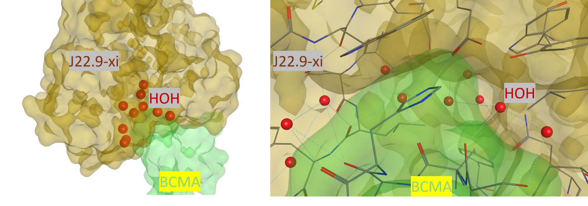
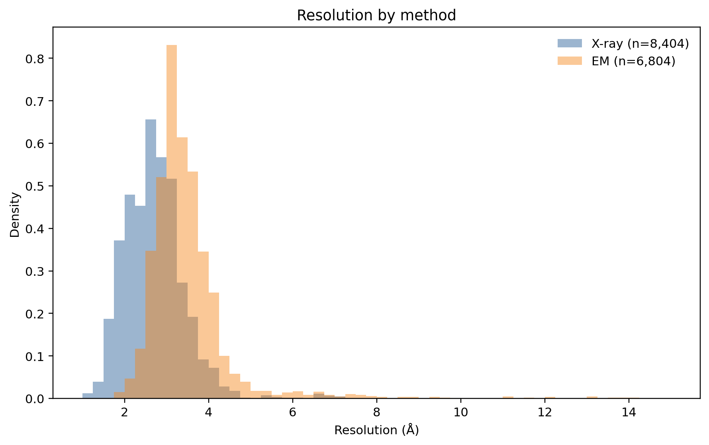
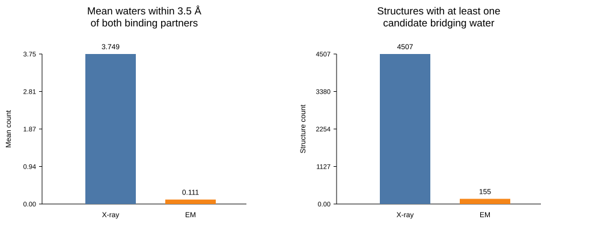

Water is easy to overlook in antibody engineering. It is everywhere, difficult to model, and often missing from deposited structures. But at antibody–antigen interfaces, water is not just passive solvent. In many complexes, it helps complete the interface itself.

That is the central point of this piece: **if we want to understand antibody recognition properly, we need to take interfacial waters seriously.**

A representative structure makes the point immediately:

*Figure 1. X-ray structure of the antibody fragment J22.9-xi in complex with BCMA (PDB: **4ZFO**, **1.89 Å** resolution). Multiple buried waters are observed at the interface, where they form water bridges between the two proteins [1].* 

---

## Why water matters

Antibody–antigen binding is often described in terms of direct contacts: hydrogen bonds, salt bridges, hydrophobic patches, and shape complementarity. Those features matter, but they are not the whole story.

Ordered waters can:

- bridge hydrogen bonds when direct geometry is imperfect
- fill cavities between binding partners
- stabilize polar networks
- sharpen specificity by favoring one local arrangement over another

This is not just a theoretical possibility. In the D1.3–lysozyme system, Braden and colleagues described **25 well-ordered interface waters** conserved across related complexes [2]. In the Fab HyHEL-5–lysozyme complex solved at **1.7 Å**, several interfacial waters help complete the fit between the two proteins [3].

Interestingly, waters in **small molecule–protein** complexes have long been treated as important design variables. In antibody–antigen binding, by contrast, the discussion is still often more dry and protein-centric than the structural evidence really supports.

---

## What large-scale structure data suggest

To look at this more broadly, I used antibody–antigen annotations from SAbDab [4], downloaded the corresponding IMGT-style structures, and applied a simple curation workflow. Starting from 16,666 filtered complexes, 16,630 could be matched to local structures, and after removing obvious annotation pathologies the cleaned comparison set contained 15,208 structures: **8,404 X-ray diffraction** and **6,804 electron microscopy**.

The key methodological point is simple: explicit waters were counted geometrically based on whether they lay near antibody chains, antigen chains, or both. Waters near both partners were used as a practical proxy for candidate interfacial or bridging waters.

The first thing that matters is resolution. X-ray structures are often solved at resolutions where ordered waters can be modeled with reasonable confidence. EM structures, especially in the broader archive, usually contain far fewer explicitly modeled waters near the interface.

*Figure 2. Overlapping resolution distributions for the cleaned comparison set after mapping PDB codes back to the original SAbDab metadata and retaining entries with usable reported resolution values. X-ray structures are concentrated at resolutions where ordered waters are more likely to be modeled explicitly, whereas EM structures occupy a broader and generally lower-resolution regime.*

That difference shows up clearly in the water summary itself:

*Figure 3. Cleaned comparison of candidate interfacial waters across structure methods. The left panel shows the mean number of waters lying within 3.5 Å of both antibody and antigen. The right panel shows how many structures in each method class contain at least one such candidate water.*

The result is hard to miss:

- **X-ray structures preserve much richer explicit water information**
- **EM structures are heavily sparse in modeled interface waters**

That does **not** mean EM complexes are physically dry. It means explicit water counts in structural archives reflect not only biology, but also observability and refinement convention.

---

## What this means

The simplest lesson is that explicit water annotations are not a neutral readout of interface chemistry. They are also a readout of what the experiment could resolve and what the deposited model chose to include.

That has two consequences.

First, we should be careful when comparing interfaces across methods. A water-rich X-ray structure and a water-poor EM structure do not necessarily imply different underlying biology. They may simply reflect different levels of explicit solvent modeling.

Second, interfacial water is likely **undercounted** in large structural archives. That is consistent with the broader literature: large-scale antibody–antigen interface analysis and dedicated tools such as AppA both treat water-mediated contacts as a meaningful part of interface interpretation [5,6].

There is also a modest but important implication for computational design. Many current workflows are excellent at reasoning over backbone geometry and direct side-chain contacts, but they still do not treat ordered interfacial waters as central design variables. That does not make those methods unusable. It simply means dry structural representations should be interpreted with caution, especially at polar and irregular interfaces.

---

## Takeaway

The main finding is simple:

> Water at antibody–antigen interfaces is not a decorative detail. It is often part of the binding mechanism.

And the large-scale structural record adds an equally important warning:

> If explicit waters are missing from a structure, that may reflect the method more than the molecule.

For antibody science, this means interfacial waters should be treated as part of the mechanistic picture—not just as leftover solvent. For computational modeling, it means that dry contact geometry is not always the full story.

---

## Limitations

This is a screening-level structural analysis, not a final mechanistic verdict.

- A water near both partners is not automatically a true bridging water.
- Geometric proximity is not the same as hydrogen-bond analysis.
- Many physically relevant waters are mobile or unresolved.
- X-ray and EM are not equally water-complete structural sources.

---

## References

[1] Tai YT, Horton HM, Kong SY, et al. **Potent in vitro and in vivo activity of an Fc-engineered humanized anti-BCMA antibody against human multiple myeloma cells.** *Molecular Cancer Therapeutics.* 2014;13(6):1568–1577. Structural context referenced here via the J22.9-xi/BCMA complex (PDB 4ZFO).

[2] Braden BC, Souchon H, Eiselé JL, Bentley GA, Bhat TN, Navaza J, Poljak RJ. **Conservation of water molecules in an antibody-antigen interaction.** *Journal of Molecular Recognition.* 1995;8(5):317–325. doi:10.1002/jmr.300080505.

[3] Li Y, Li H, Yang F, Smith-Gill SJ, Mariuzza RA. **Water molecules in the antibody-antigen interface of the structure of the Fab HyHEL-5-lysozyme complex at 1.7 Å resolution: Comparison with results from isothermal titration calorimetry.** *Acta Crystallographica Section D: Biological Crystallography.* 2005;61(5):628–633. doi:10.1107/S0907444905007870.

[4] **Structural Antibody Database (SAbDab).** OPIG, University of Oxford. Available at: <https://opig.stats.ox.ac.uk/webapps/sabdab-sabpred/sabdab>.

[5] Sánchez-García R, Sorzano COS, Carazo JM, Segura J. **Antibody-Antigen Binding Interface Analysis in the Big Data Era.** *Frontiers in Molecular Biosciences.* 2022;9:945808. doi:10.3389/fmolb.2022.945808.

[6] Tran NH, Pham T, Satou K, Ho TB, Pham TH. **AppA: a web server for analysis, comparison, and visualization of contact residues and interfacial waters of antibody–antigen structures and models.** *Database (Oxford).* 2019;2019:baz035. doi:10.1093/database/baz035.
