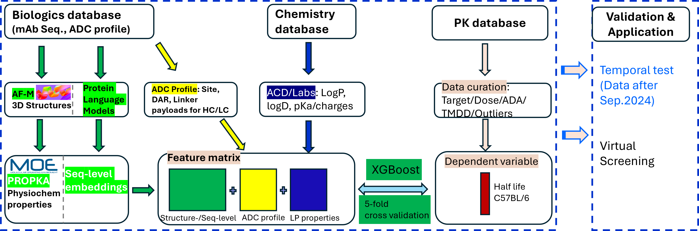
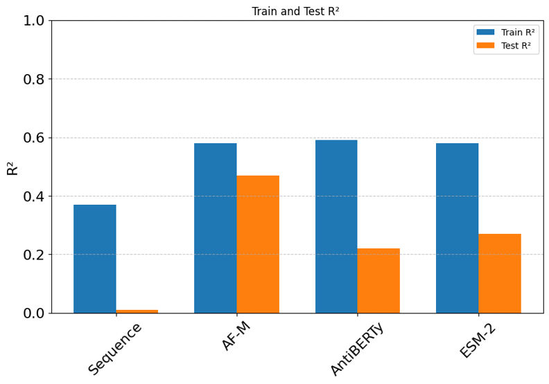
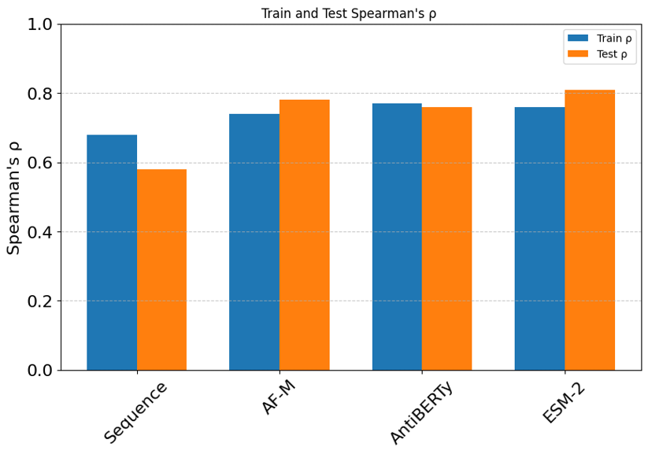

## Overview

ADC development has long relied on slow, iterative in vivo studies. Directly modeling ADCs presents significant challenges due to their unique hybrid nature, combining biologics and small molecules. Existing protein or small-molecule force fields are not designed to capture this complexity, and there is little precedent for applying graph neural networks to such systems.

In our study, we set out to change that to transform data into models-and models into insight.

We introduced a [**multi-modal machine learning framework**](https://www.tandfonline.com/doi/full/10.1080/19420862.2026.2657646) and demonstrated that this modular platform can effectively predict in vivo pharmacokinetics.

---

## Multi-Modal Learning Framework

> **Figure 1. Multi-modal feature learning workflow integrating AF-M structures, protein language models, ADC profiles, and linker-payload properties into an XGBoost framework (adapted from this study).**

This framework deconvolutes ADCs into three fundamental components and applies tailored feature engineering to represent each effectively:
- Antibody characterization
    - structure-based physicochemical properties
        - [**AlphaFold-Multimer (AF-M)**](https://github.com/google-deepmind/alphafold) structures for properties like hydrophobilicty patches and surface charges. **Note**: at the time this work was initiated, AlphaFold-Multimer was effectively the only tool capable of modeling full-length antibody structures with sufficient accuracy and scalability.
    - sequence representation
        - [Sequence-based physicochemical properties](https://github.com/althonos/peptides.py)
        - **Protein language models ([AntiBERTy](https://github.com/jeffreyruffolo/AntiBERTy), [ESM-2](https://github.com/facebookresearch/esm))**
        - 
- Conjugation features (DAR, site)
    - one-hot representation for conjugation sites
- Linker-payload physicochemical properties

These features are unified into a single matrix for model training. The models were developed on a combined dataset of 118 mAbs and ADCs, with a temporally separated test set of 32 mAbs/ADCs used for evaluation. As you pointed out, mAbs lack many conjugation and linker-payload features, so XGBoost was selected for its ability to handle missing data.

---

## Model Performance: R² (Train vs Test)

> **Figure 2. R² comparison between training and test sets across feature modalities (adapted from this study).**

### Key observations:
- **AF-M (structure-based)** models show the **highest test accuracy**
- **Sequence-only** models fail to generalize
- **AntiBERTy / ESM-2** show strong training performance but reduced test R²

---

## 📈 Rank Ordering Performance: Spearman’s ρ

> **Figure 3. Spearman’s ρ comparison between training and test sets (adapted from this study).**

### Key observations:
- **PLM models (AntiBERTy, ESM-2)** show **strong rank-order correlation**
- **ESM-2 performs best in ranking tasks**
- AF-M remains competitive but is optimized for absolute prediction

---

## 💊 FDA-Approved ADC Evaluation

We evaluated the model on **FDA-approved and late-stage ADCs**, including molecules outside the training distribution.

- Diverse targets  
- Different linker chemistries  
- New conjugation strategies  

### Result:
- Predictions fall within ~1.5× experimental values
- Acceptable models for **clearance** and **Volume of distribution** were also developed

> **Takeaway:**  
**Structure-based features (AF-M) drive quantitative predictive accuracy.**
> **Takeaway:**  
**PLMs excel at ranking candidates, while AF-M excels at precise prediction.**
> **Takeaway:**  
The model captures **generalizable PK principles**, extending beyond the training dataset.

---

## 🚀 Practical Impact

### Before:
Design → Synthesize → Test → Iterate

### Now:
Design → Predict → Prioritize → Test

### Strategy:
1. Use **ESM-2 / AntiBERTy** for large-scale screening  
2. Use **AF-M models** for accurate PK prediction  

---

## Final Takeaways

- **AF-M structure-based modeling is the key innovation**  
- **PLMs (ESM-2, AntiBERTy) enable scalable ranking**  
- **Time-split validation confirms robustness**  
- **FDA ADC evaluation demonstrates real-world applicability**  
- **Early PK prediction is now feasible**

---

## Closing Thought

This framework shifts ADC development from empirical iteration to **predictive prioritization**, enabling faster and more efficient discovery.